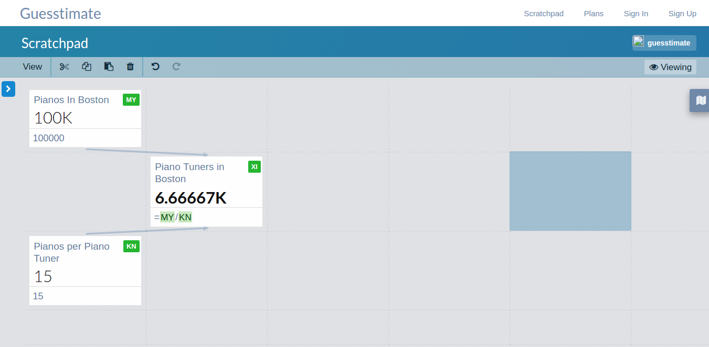
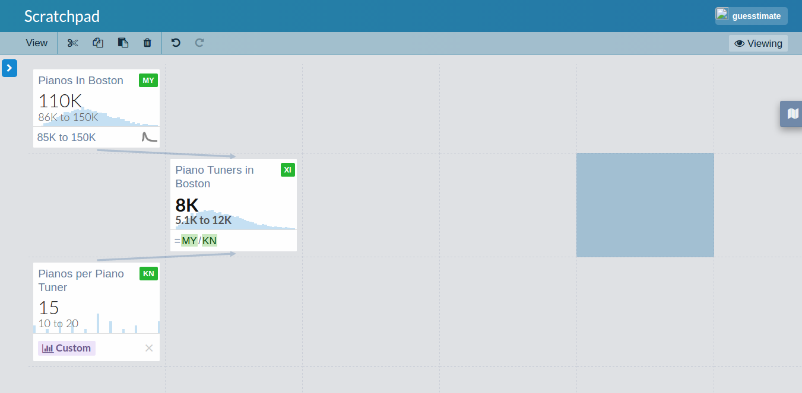

# Guesstimate

Guesstimate is a spreadsheet tool that helps you model and forecast uncertain quantities. Guesstimate's interface is
similar to other spreadsheet tools, such as Excel or Google Sheets. Each model is a grid of cells, and each cell can
be filled with a name and value. Functions can be used to connect cells together to represent more complex quantities.

For example, a simple model of how many piano tuners there are in Boston might look like this:

#### Use Numbers With Uncertainty

In addition to the standard spreadsheet capabilities, Guesstimate can also be used for modeling under uncertainty. The
primary way of introducing uncertainty into a Guesstimate model is via a _confidence interval_, expressed as a range of
the form `X to Y`, or via a dataset. Both ranges and datasets can be inserted directly into a Guesstimate cell, and the
system will perform all downstream calculations in a statistically meaningful way.

For example, if we expand our Boston piano tuner population model from above to account for uncertainty, we might say
that instead of there being 100,000 pianos in boston, there are somewhere between 85,000 and 150,000 pianos in Boston.
We can also add some custom data to our pianos per tuner estimate by polling all of our piano tuner friends to see how
many pianos they service, then entering their responses as a comma or enter separated list directly into the cell.

#### Share Your Results

Guesstimate supports public, private, and private organizational models.

Public models can be seen by anyone, but only edited by their owners. Any viewer of a model will be able to locally edit
the model, but their changes won't be saved. You can browse all our existing public models
[here](https://www.getguesstimate.com/models).

Private models are only visible to their creator, and private
organizational models are visible to everyone within the owning organization. Private models & private organizational
models are only available on our [paid plans](https://www.getguesstimate.com/pricing).

#### Short Demo
<iframe width="560" height="315" src="https://www.youtube.com/embed/_fZdBq0TOPk" frameborder="0" allowfullscreen></iframe>
