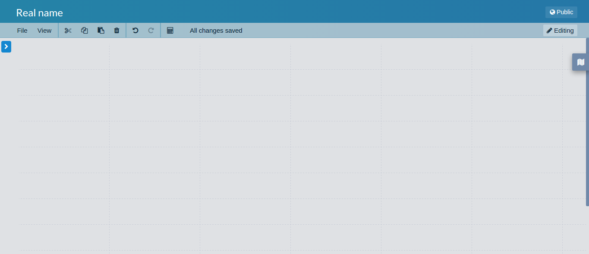
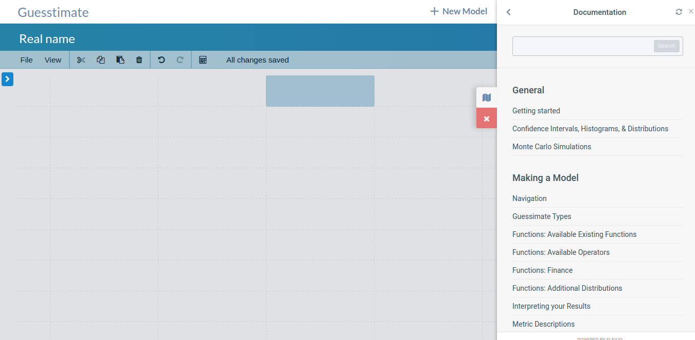
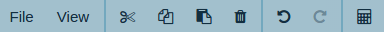
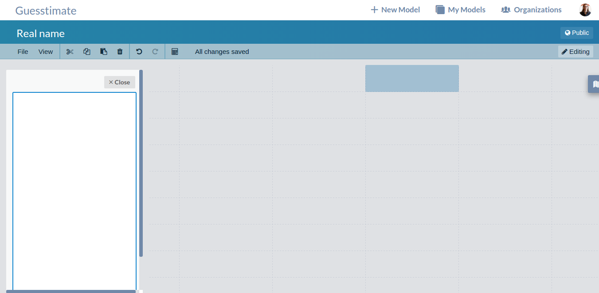
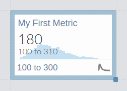

# Modeling
### The Canvas

The guesstimate canvas is the environment in which all Guesstimate models are made. It is a grid of cells, similar to a
spreadsheet, and each empty cell can be filled with a metric (see below). There are several aspects to the canvas:

#### Documentation Widget
The documentation widget is located along the right edge of the canvas. Clicking on the documenation widget opens a
documentation sidebar, giving quick access for modelling help.

#### Canvas Toolbar
The canvas toolbar sits just beneath the model name, and contains menus and buttons to take various actions on the
model or selected metrics.

The buttons are (from left to right):

| Name             | Description                                                                                                         | Keyboard Shortcut                    |
| ---------------- | ------------------------------------------------------------------------------------------------------------------- | ------------------------------------ |
| File Menu        | Has nested options for copying or deleting the model entirely, and importing [SIPs and SLURPs](sips_and_slurps.md). | N/A                                  |
| View Menu        | Has nested options to toggle different view states and turn on or off arrows.                                       | N/A                                  |
| Cut Button       | Cuts (copies, then deletes) all currently selected metrics                                                          | ctrl/cmd - x                         |
| Copy Button      | Copies all currently selected metrics                                                                               | ctrl/cmd - c                         |
| Paste Button     | Pastes the currently copied region onto the selected cell.                                                          | ctrl/cmd - v                         |
| Delete Button    | Deletes all currently selected metrics                                                                              | del/bksp                             |
| Undo Button      | Undoes the most recent change to the model                                                                          | ctrl/cmd - z                         |
| Redo Button      | Redoes the most recently undone change to the model                                                                 | ctrl/cmd - shift - z or ctrl/cmd - y |
| Calculator Menu  | Allows you to view and create calculators off this model                                                            | N/A                                  |

On the far right of the toolbar (not shown above) is a dropdown menu to toggle view mode or edit mode. In view mode, you
can interact with the model, but changes will not be saved, whereas in edit mode, changes will be saved.

#### The Model Description
The model description allows you to describe a model in more detail than just the name. Here, you can include citation,
long-form explanations, images, or links to more information. The description is edited in [Markdown](markdown.md). To
open the description, click on the 'right arrow' button on the left side, at which point you will see a form where you
can edit the description.

### Metrics
You can fill canvas cells with _metrics_. A metric can have a name, description, and a value.

To create a metric, simply double click on any empty cell in the canvas.

Metric names are used for reference, and their descriptions (which, like model descriptions, use
[Markdown](markdown.md)) can provide sources or additional context around a metric value.

Metric values can be of several different types. These are explored in more detail [here](input_types.md).

The metric card will report information about the value of that metric. For help interpreting these results, see
[here](interpreting_your_results.md).
