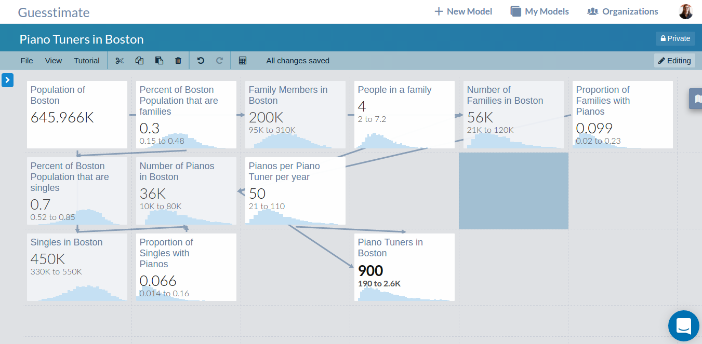
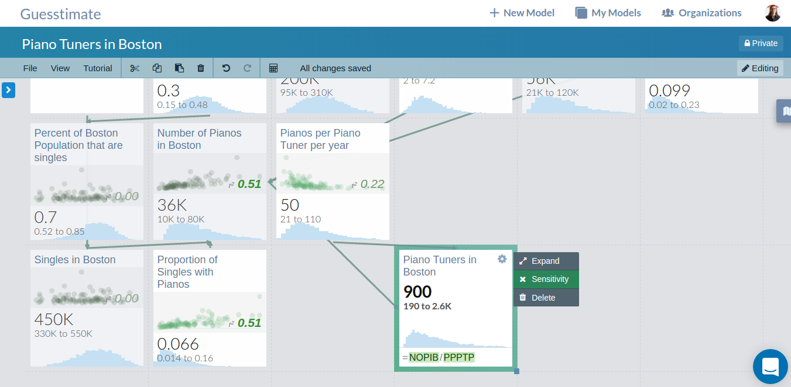
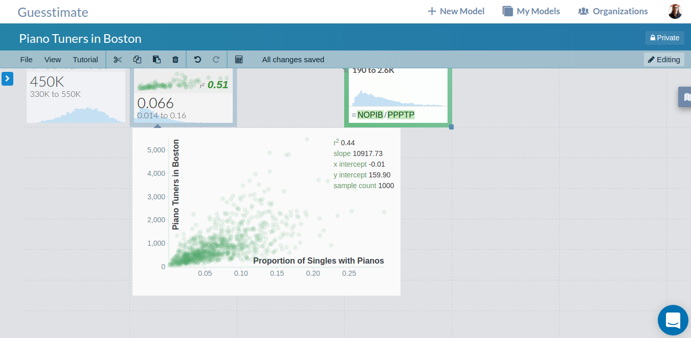

## Analysis Mode
A complicated model can give you powerful insight about its output, but how can you best refine those predictions?
Lowering the uncertainties on your inputs will help lower the uncertainty on your outputs, but collecting additional
data and refining your input estimates is expensive, and prioritizing which inputs to refine first is very important. To
help with this process, Guesstimate offers _Analysis Mode_, which helps you analyze how model inputs affect model
outputs.

To enter analysis mode, simply open the metric sidebar, by clicking the 'gear' icon in the upper right corner of the
metric card, then click 'Sensitivty'. Once you do this, all related metrics in the model will display visual sensitivity
analysis plots, comparing their samples to the selected metric's samples. Each plot is a scatter plot, comparing the
samples of the corresponding metric on the $$x$$ axis to the originally selected metric on the $$y$$ axis.

For example, consider this model, which analyzes how many piano tuners there might be in Boston:

We can see that the output estimate here has quite a bit of uncertainty, ranging from 190 to 2,400! If we want to
understand which of the many input variables are yielding the most output uncertainty, we simply enter analysis mode.

To determine which inputs are causing the most output uncertianty, we can examine the scatter plots, looking for the
highest correlation between any of the input nodes and our output. We look for the highest correlation because a higher
correlation means that small deviations in the input affect the output more than nodes with a lower correlation. As the
input's deviation is goverened by its uncertainty, this indicates which uncertainty is affecting the output most. In
this case, the input node 'Proportion of Singles with Pianos' has the highest correlation and thus affecting the output
the most. By hovering over the small scatter plot, we can also see an expanded version which offers more details about
the relationship between the two nodes.

Given this information, we can be confident that if we refine our estimate of the proportion of singles with pianos,
then our output estimate for the number of piano tuners in boston will also lose uncertainty.
