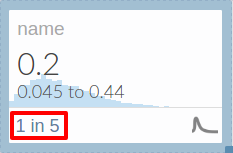

# Input Types

Guesstimate cells support several diferent types of inputs.

#### Point Values

Point values are exact numbers. Enter a value by simply typing that value.

#### Confidence Intervals

[Confidence intervals](./theory/confidence_intervals.md) are statistical expressions of uncertainty about a quantity.
Enter a confidence interval by entering your lower and upper bounds for the interval into the value field, separated by
the word 'to', like this: `low to high`.

Guesstimate can convert your confidence interval into three different possible formal distributions.

1.  [Normal Distributions](https://www.google.com/url?sa=t&rct=j&q=&esrc=s&source=web&cd=1&cad=rja&uact=8&ved=0ahUKEwjZ1ZDQyrfLAhVkr4MKHXOxDHsQFggcMAA&url=https%3A%2F%2Fen.wikipedia.org%2Fwiki%2FNormal_distribution&usg=AFQjCNEOuAsc3h-p3E2f0u3Cnkdz3Np1kQ&sig2=u_UI4k0Y9zBKC7DA8vx6VQ&bvm=bv.116573086,d.dmo): This should be used when you think that values near the center of your range are more likely than values near the edges of your range, and values outside your range are possible, but increasingly unlikely.  
    Guesstimate interprets your input as a 90% CI distributed symmetrically about the mean.
2.  [Uniform Distributions](https://en.wikipedia.org/wiki/Uniform_distribution_(continuous\)) : This should be used when
    you are 100% certain that the value would fall within your range, and it is equally likely it would fall anywhere
    within your range.
    Guesstimate interprets your input as the full range of possible values the metric could take.
3.  [Lognormal Distributions](https://www.google.com/url?sa=t&rct=j&q=&esrc=s&source=web&cd=1&cad=rja&uact=8&ved=0ahUKEwjxk_XRyrfLAhXswYMKHUxfB6sQFggdMAA&url=https%3A%2F%2Fen.wikipedia.org%2Fwiki%2FLog-normal_distribution&usg=AFQjCNH6r87BB9IaLASYhr0DIL88rh0OGQ&sig2=Uckv53L7BzDE_SuiDJKmqQ): This should be used when your value must be positive, and is more likely near the left edge of your range than the right, but has a long tail of possibility to the right (more specifically, when values are symmetrically likely on the log scale across the multiplicative center of your range).  
    Guesstimate interprets your input as a 90% CI with your left endpoint at the 5th percentile and your right at the 95th percentile.  
    For lognormal, both endpoints of your confidence interval must be positive.

##### Proportions

Guesstimate can also convert your estimates of proportionality into a
[beta distribution](https://en.wikipedia.org/wiki/Beta_distribution), which is designed to work well for estimates of
proportions/percentages. To enter a proportion, simply express the proportion via the syntax `events of/in total` (e.g.
`1 of 5`, `3 in 10`).

When you say '1 of 5', Guesstimate will generate a distribution between 0 and 1 centered around 0.2, with uncertainty
reflective of the precision in your estimate (e.g.  `1 of 5` will have more uncertainty than `200 of 1000`).

##### Functions (=)

Values can be functions of other metrics. To do this, simply begin the field with an 'equals' sign, followed by the
formula. Each metric has a two letter variable name.

You can type this explicitly or simply click on that metric while the function is selected to insert it. You can also
use functions to specify specific distributions, with additional parameters. For example, if you wish to specify a
normal distribution by mean and standard deviation, you can do this via the functional form. This is covered in the
[Additional Distributions](../functions/distributions.md) article.

#### Custom Data

Custom data can be entered directly into the 'value' field by simply pasting a stream of comma, enter, or space
separated values. You can also expand the card into its full, expanded view, then edit the custom data field directly.
This view accepts comma separated values as well. Data will be up or down sampled to approximately 5000 samples, to
match the other nodes.
