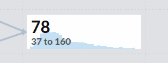
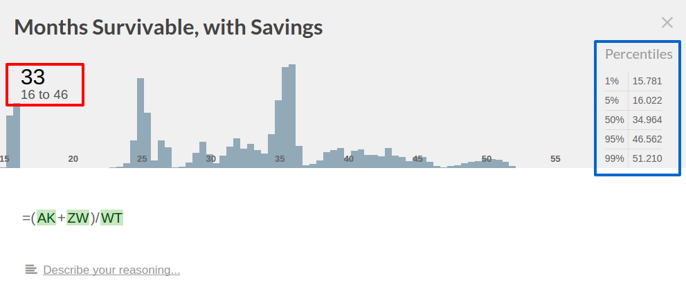

# Interpreting Your Results

The metric card will show the expected value of that metric and a 90% confidence interval (CI) around that value; in this
example, the card shows that the metric has an expected value of 78, and 90% of the time the value of the metric is
between 37 and 160. This 90% confidence interval is formed from the upper 95% of the samples below the mean and the
lower 95% of the samples above the mean.

The expanded view shows the same mean and CI (red box) and a table of percentiles (blue box). Percentiles show how
likely it is that the observed value would fall below a threshold; here, there is a 1% chance that you could only
survive for fewer than 15.781 months, and a 95% chance that you could only survive for fewer than 46.562 months.

To ask, "How often will I be able to survive for more than 46.562 months?", simply subtract the percentile for that value
(95%) from 100%. Here, you could survive for more than 46.562 months only 5% of the time.
