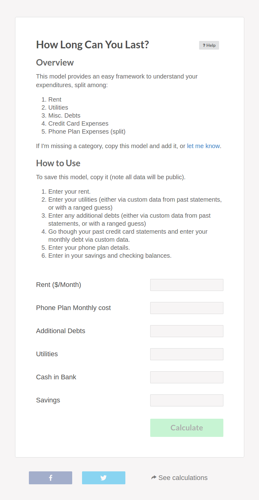
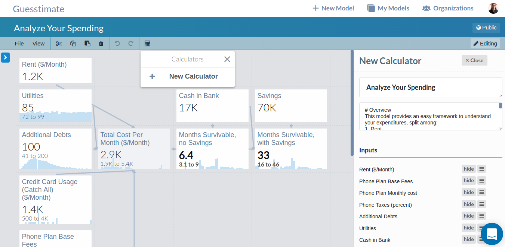

## Calculators

Sometimes, you may find yourself consistently using a complex model, changing only a few input metrics and checking only
a few output metrics each time. In this case, it may be more helpful to create a _calculator_ from that model.
Calculators allow you to isolate a small number of input nodes and output nodes to display as a form rather than a
model. Any viewer of the space  can then enter different numbers for the selected inputs, and the selected outputs,
computed using the rest of the model's saved inputs, will be displayed. A calculator defined by a private space is only
visible to people who have access to that private space, either the owner or members of the owning organization. A
calculator defined by a public space is visible to anyone.

Here is an [example caluclator](https://www.getguesstimate.com/calculators/71),
created from [this model](https://www.getguesstimate.com/models/4457):

Calculators are especially useful when a model serves as a template, to be used repeatedly with different inputs, or
when you want to survey many people about their predictions. To create a calculator, click on the 'calculator' icon
within the modeling toolbar. Then, you will see a menu that will allow you to create a new calculator. You will be able
to select which inputs you want to present to the user, and which outputs to display upon calculation.

Calculator inputs support point values (`100`), ranges, (`100 to 300`), proportionality estimates (`1 of 10`), and
empirical datasets (`1,2,1,3,2,2,4,...`). For more information on these input types, see
[here](basic_modeling/input_types.md). Similarly, output values will either be displayed as points or distributions,
depending on the underlying input values and model. If you need more information on what is supported, simply click the
'Help' button in the upper right corner of the calculator. Additionally, once you've filled out a calculator and seen
your output, you can click the 'See calculations' button beneath the calculator to go to the underlying model and see
how everything was computed. Once you do so, though, *be careful*, as your inputs to the calculator will overwrite the
values present by default in that model, and if you go to editing mode and save that space, your previous defaults will
be overwritten.

If you find a calculator that you like, you can share it directly from the calculator page, via the facebook and twitter
share buttons beneath the calculator. This way, you can compare your estimates and forecasts, with those of your friends
or followers.
