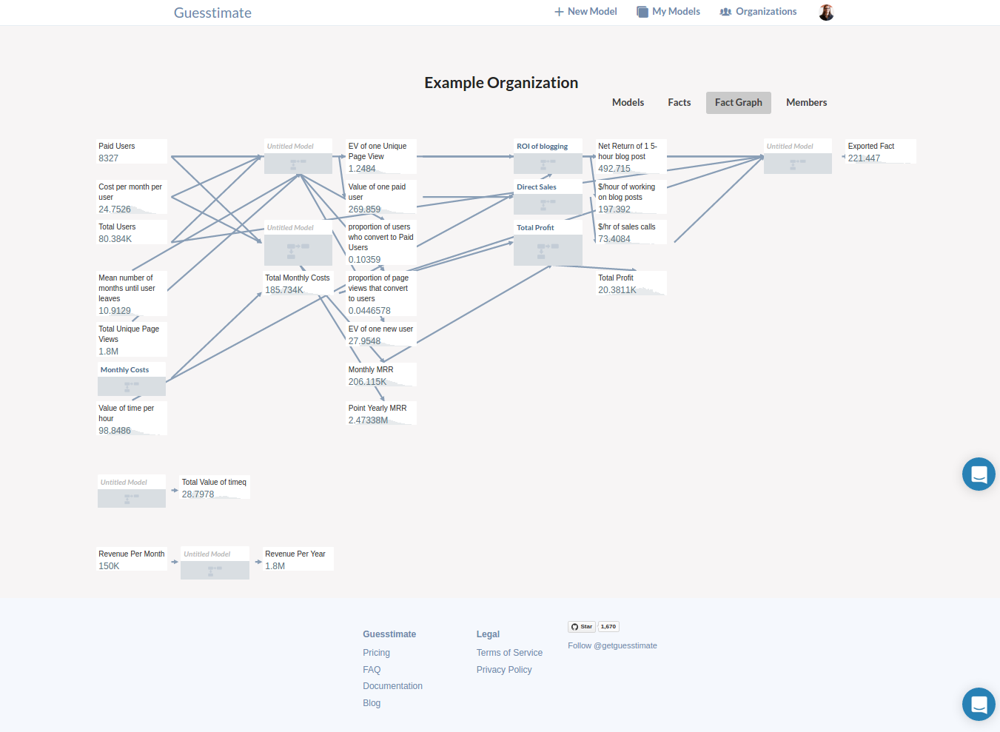

# Facts

## Global Facts

Guesstimate maintains a database of certain global facts that can be used in any function in any model. Right now, this
dataset is limited to city population sizes, for a select, but extensive list of cities. to use these facts, simply type
an '@' sign, followed by the city name, then a '.' followed by the word, 'population' within a functional form, like
this:

## Organizational Facts

*Organizational facts are available only to organizations with private plans.*

Have a few similar metrics that are used in multiple sheets?  You can use facts to have some constants that will be
similar among all of your models.

Organization level facts are currently all private and are only available for use in private models.

### Creating & Editing Facts
#### Static Facts

Each fact has a ** value**, **name**, and **hashtag**. 

The **value** is a numeric value that represents the current expectation or known value for the fact.  For instance,

``34.8``,

or

``40K to 43K``.

The value can be a data input. It cannot be a function. Also, if this is a range, you will not be able to choose between
the standard distribution options for that range.

The **name** is whatever you want to use to refer to the fact. It is only used for your own reference.

The **hashtag** is what you can use to refer to the fact inside of a metric in a model. As opposed to global facts,
which are referenced with the `@` symbol, organizational facts are referenced via a automatically generated or user-set
hashtag, as shown below:

Facts can be simply added or edited. They are findable on the organizations' page. We suggest being careful with
deleting facts: while this is possible, if you have a model that uses that fact, that model may break.

#### Exported Facts

Facts can also be exported from metrics within private models within your organization. To export a fact from a metric,
simply open the metric sidebar and select 'Export':

Only named metrics containing functions can be exported. Once a metric has been exported as a fact, deleting either that
metric or that fact will delete the associated fact. Furthermore, the metric card is marked with an _exported_ symbol in
the upper right corner of the card, as below:

Exported facts take on the name of the owning metric, an automatically assigned hashtag based on that name, and the
value of that metric.  The resultant facts are kept in-sync with the owning model, even if upstream facts used in the
model change. In this way, you can connect disparate facts together via models that relate one fact to another. You can
explore these dependencies via the _Fact Graph_, accessible on the organization page. The fact graph also will show
which models within your organization use which facts, even if those models do not export facts of their own.

### Using Facts

Facts are simple to use in models.  In a function, type the hashtag that represents a fact in order to refer to it.
This should auto-complete, so after typing the first few characters, you can click **TAB** to complete the word.

Facts are still an experimental feature; if you encounter any issues in their usage, please contact us.
