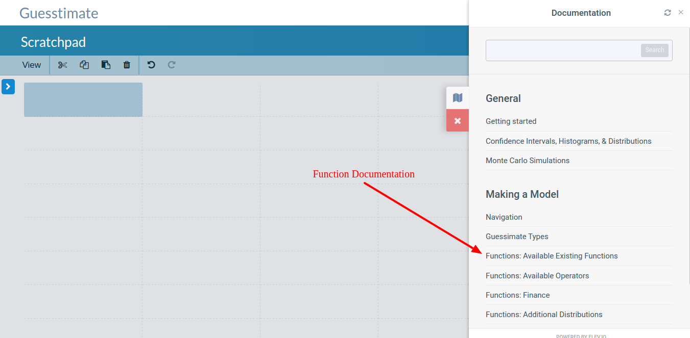

# Frequently Asked Questions

#### What can Guesstimate be used for?

Guesstimate is great for modeling things that aren't certain. You can forecast your earnings from a new
venture, predict the amount of time completing a big project will take, or experiment with scientific theories. People
have used it to optimize video games, understand lottery payoffs, and estimate the costs of childcare.

Guesstimate is most commonly used for cost estimation and forecasting within small companies. If you're not sure how
Guesstimate can help you or your business, contact us at <ozzie@getguesstimate.com> to set up a free consultation
session to analyze your modeling needs.

#### What are some good examples?

The most popular model on Guesstimate is [How Long it Takes to Get Ready for
Preschool](https://getguesstimate.com/models/314). We also recommend checking out Ozzie Gooen's models
[here](https://getguesstimate.com/users/1), and all our public models, [here](https://www.getguesstimate.com/models)

#### Are there private models?

Yes, Guesstimate offers paid plans for private individual or organizational models. Check out our
[pricing page](https://getguesstimate.com/pricing) for more information.

#### What functions are available on Guesstimate?

An in-depth look at our available functions can be found [here](./functions/README.md).

Additionally, you can find a list of the available functions while modeling by clicking on the **documentation** widget
on the right, then clicking **Functions: Available Existing Functions**.

The documentation widget is located here:

#### Can I edit someone else's model?

Your own models autosave when you edit them. If you edit models created by other people, you will be able to modify
them, but your changes will not be saved. This can be great for experimentation or for entering your own assumptions in
a different model.

#### How is this different from Oracle Crystal Ball or other existing tools?

Guesstimate is a web application, while Crystal Ball is a suite of Excel-based applications. This means that with
Guesstimate you can get up and running in 30 seconds on any computer and then share your model with anyone. Crystal Ball
is better for more rigorous analysis, and gives you access to the Excel environment and ecosystem.

One great combination may be to quickly experiment with models in Guesstimate, then replicate the best model in Crystal
Ball when you want to do more detailed analysis.

#### Who is behind Guesstimate?

Ozzie Gooen and Matthew McDermott.

#### Is it open source?

Yes. You can check out the [GitHub repo](https://github.com/getguesstimate/guesstimate-app).

#### Where can I find more information on Guesstimate?

We have a blog [here](https://medium.com/guesstimate-blog).

#### I found a bug!

Please file it in our bug tracker on [GitHub](https://github.com/getguesstimate/guesstimate-app), or just open up chat
(bottom right) and let us know. If your bug is security related, please alert us immediately at
[matthew@getguesstimate.com](mailto:matthew@getguesstimate.com).

# Math Related Questions

#### How do you produce statistically accurate results?

Guesstimate uses [Monte Carlo](https://en.wikipedia.org/wiki/Monte_Carlo_method) techniques to produce our results. The
Monte Carlo method involves repeatedly sampling the underlying probability distributions of a random variable and
performing all calculations involving that random variable many times, with those sampled values. The Monte Carlo method
is a brute force, random process of approximating the true, resulting distribution.

For example, if you wanted to compute the value of $$X \times Y$$, where $$X$$ and $$Y$$ are random variables (such as
Guesstimate cells whose inputs are ranges, or data streams), then using the Monte Carlo method you would compute many
sample values for $$X$$ and many sample values for $$Y$$, then multiply those samples together pairwise to produce the
output distribution for $$X \times Y$$.

#### Why isn’t the math done analytically?

Monte Carlo simulations are far more general than analytical solutions, so apply to more equations and distributions. In
the future, analytical techniques may be used when possible.

#### What distribution types are supported?

Range & proportionality input mechanisms can span normal, lognormal, uniform, and beta distributions. Additionally, many more
distributions are available through the [function interface](./functions/distributions.md).

#### How many samples are done per cell?

5000 samples are performed per stochastic expression. 5000 is enough to be useful for most estimates, but not enough to
slow the system down. In the future, this amount may be variable depending on the need and circumstances.
