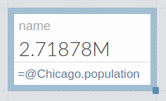

# Global Metrics
Most metrics made in a model are only available in that model.  These can be called **local** metrics.  However, there are also some **global** metrics available in all Guesstimate models, and other **organizational** metrics available to organizational models.

Guesstimate maintains a database of certain global metrics that can be used in any function in any model. Right now, this
dataset is limited to city population sizes, for a select, but extensive list of cities. To use these metrics, simply type
an '@' sign, followed by the city name, then a '.' followed by the word, 'population' within a functional form, like
this:

