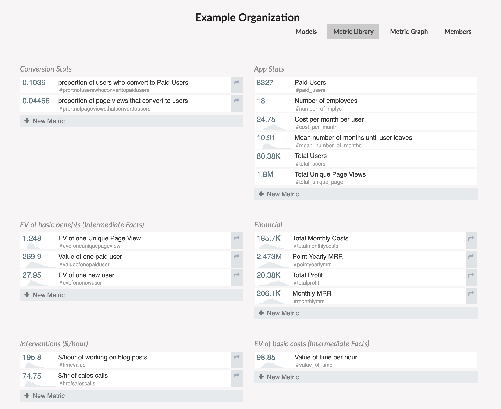
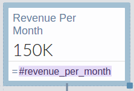
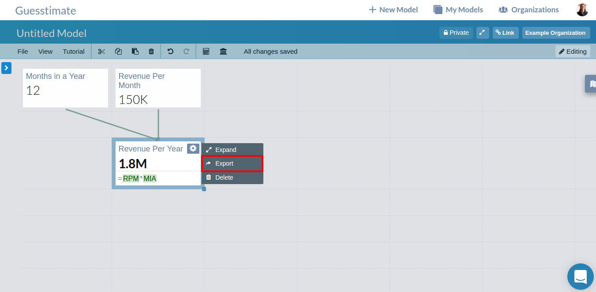
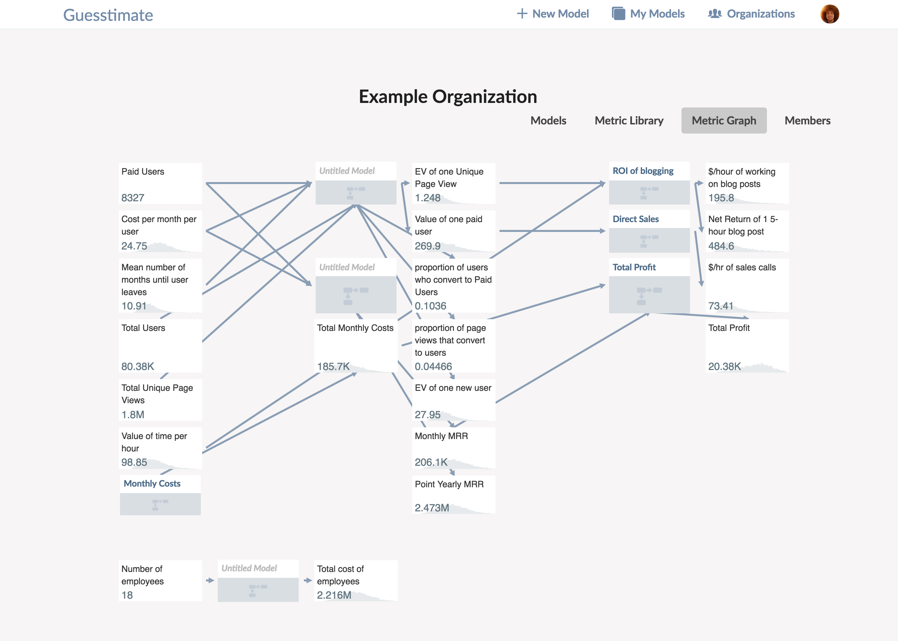

# Organizational Metrics

Have a few similar metrics that are used in multiple sheets?  You can use organization metrics to have some constants that will be
similar among all of your organization's models.

Organizational metrics are stored in what is called the organization **metric library.**
All organizational metrics are completely private and are only available for use in private models. Organizational metrics are available only to organizations with private plans.

## Basic Organization Metrics
To create some basic organizational metrics available in all models, go to the organization Metric Library page.

From there, it's simple to add a new organizational metric. This will be available in all organizational models.

Each metric has a ** value**, **name**, and **hashtag**.

The **value** is a numeric value that represents the current expectation or known value.  For instance,

``34.8``,

or

``40K to 43K``.

The value can be a data input. It cannot be a function. Also, if this is a range, you will not be able to choose between
the standard distribution options for that range.

The **name** is whatever you want to use to refer to the metric. It is only used for your own reference.

The **hashtag** is what you can use to refer to the organizational metric inside of a local metric in a model. As opposed to global metrics,
which are referenced with the `@` symbol, organizational metrics are referenced via a automatically generated or user-set
hashtag, as shown below:

Organizational metrics can be simply added or edited. We suggest being careful with
deleting these metrics: while this is possible, if you have a model that uses that metric, that model may break.

## Exported Metrics

Organizational metrics can also be exported from metrics within private models within your organization. To export a metric,
simply open the metric sidebar and select 'Export':

Only named metrics containing functions can be exported. Once a metric has been exported to the organizational library, deleting either that
local metric or that organizational metric will delete the associated organizational metric. Furthermore, the metric card is marked with an _exported_ symbol in
the upper right corner of the card, as below:

Exported organizational metrics take on the name of the owning metric, an automatically assigned hashtag based on that name, and the
value of that metric.  The resultant metric are kept in-sync with the owning model, even if upstream metrics used in the
model change. In this way, you can connect disparate metrics together via models that relate one metric to another.

## The Metric Graph

You can explore metric and model dependencies via the _Metric Graph_, accessible on the organization page. The metric graph also will show
which models within your organization import and export which library metrics, even if those models do not export metrics of their own.

## Using Organizational Library Metrics

Organizational metrics are simple to use in models.  In a function, type the hashtag that represents an organizational metric in order to refer to it.
This should auto-complete, so after typing the first few characters, you can click **TAB** to complete the word.

Organizational metrics are still an experimental feature; if you encounter any issues in their usage, please contact us.
