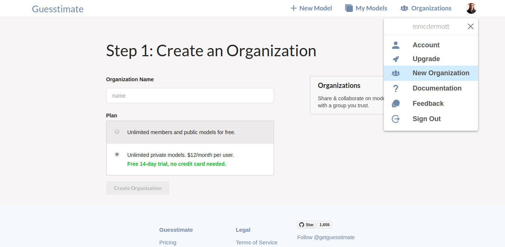

### Organizations

Organizational accounts allow you to share models within a group, so that your whole team can collaborate on models.
Organizational accounts have two plans: free, with unlimited public models, and paid, with unlimited public & private
models. Anyone with an organization can create or edit models owned by the organization.

Organizations can also store [facts](facts.md), which are named variables you can use across many models.

To create an organization, log in, then click on the user menu in the top right, then click on the 'New Organization'
option, or navigate directly to [the new organization page](https://www.getguesstimate.com/organizations/new)

